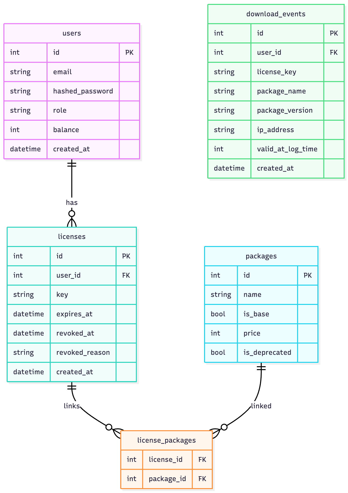

# Datacebo Backend

FastAPI app with SQLite, Pydantic v2, and pytest.

## Requirements

- Python 3.11+
- pip and venv (recommended)
- SQLite 3 (bundled with Python on most systems)
- Optional: `jq` for parsing JSON in cURL examples

Environment variables (override defaults in a `.env` file at repo root):

```env
# Security (set strong secrets in non-dev)
ACCESS_TOKEN_SECRET=dev-access-secret-change-me
REFRESH_TOKEN_SECRET=dev-refresh-secret-change-me
JWT_ALGORITHM=HS256
ACCESS_TOKEN_EXPIRES_MINUTES=15
REFRESH_TOKEN_EXPIRES_DAYS=7

# App
APP_NAME=Datacebo API
DEBUG=false

# Database (default SQLite file)
DATABASE_URL=sqlite:///./app.db

# Cookies
REFRESH_COOKIE_NAME=refresh_token
REFRESH_COOKIE_PATH=/auth/refresh
REFRESH_COOKIE_SECURE=false
REFRESH_COOKIE_SAMESITE=lax

# Licensing
LICENSE_DEFAULT_DAYS=30
```

## Install

Create a venv and install deps:

```bash
python3 -m venv .venv
source .venv/bin/activate
pip install -e .[dev]
```

## Run

```bash
uvicorn app.main:app --reload
```

## Test

```bash
pytest
```

## API Docs

- Swagger UI: `http://localhost:8000/docs`
- ReDoc: `http://localhost:8000/redoc`

## Database Schema



## Quick cURL setup

```bash
BASE="http://localhost:8000"
```

### Auth: Register, Login, Promote to Admin

```bash
# Register a user
curl -sS -X POST "$BASE/auth/register" \
  -H 'Content-Type: application/json' \
  -d '{"email":"admin@example.com","password":"secretpass"}'

# Login to get access token
ADMIN_TOKEN=$(curl -sS -X POST "$BASE/auth/login" \
  -H 'Content-Type: application/json' \
  -d '{"email":"admin@example.com","password":"secretpass"}' | jq -r .access_token)

# (Bootstrap) Promote the first user to admin (requires admin; for local bootstrap you can set via DB)
# Option A: If you already have an admin, use API to promote another user:
# curl -sS -X PATCH "$BASE/users/2/role" -H "Authorization: Bearer $ADMIN_TOKEN" -H 'Content-Type: application/json' -d '{"role":"admin"}'
# Option B: For first-run bootstrap, update SQLite directly (example):
# sqlite3 app.db "UPDATE users SET role='admin' WHERE id=1;"
# Then login again to issue a token that includes the admin role
ADMIN_TOKEN=$(curl -sS -X POST "$BASE/auth/login" \
  -H 'Content-Type: application/json' \
  -d '{"email":"admin@example.com","password":"secretpass"}' | jq -r .access_token)

# Create a normal user
curl -sS -X POST "$BASE/auth/register" \
  -H 'Content-Type: application/json' \
  -d '{"email":"user@example.com","password":"secretpass"}'
USER_TOKEN=$(curl -sS -X POST "$BASE/auth/login" \
  -H 'Content-Type: application/json' \
  -d '{"email":"user@example.com","password":"secretpass"}' | jq -r .access_token)
```

### Packages: Create, List, Deprecate/Undeprecate

```bash
# Create base package (admin)
BASE_PKG=$(curl -sS -X POST "$BASE/packages/" \
  -H "Authorization: Bearer $ADMIN_TOKEN" \
  -H 'Content-Type: application/json' \
  -d '{"name":"baseA","is_base":true,"price":100,"is_deprecated":false}')
echo "$BASE_PKG" | jq .
BASE_ID=$(echo "$BASE_PKG" | jq -r .id)

# Create add-on package (admin)
ADDON_PKG=$(curl -sS -X POST "$BASE/packages/" \
  -H "Authorization: Bearer $ADMIN_TOKEN" \
  -H 'Content-Type: application/json' \
  -d '{"name":"addonX","is_base":false,"price":50,"is_deprecated":false}')
ADDON_ID=$(echo "$ADDON_PKG" | jq -r .id)

# List packages (non-deprecated only)
curl -sS "$BASE/packages/" | jq .

# List including deprecated
curl -sS "$BASE/packages/?include_deprecated=true" | jq .

# Deprecate a package (admin)
curl -sS -X POST "$BASE/packages/$ADDON_ID/deprecate" -H "Authorization: Bearer $ADMIN_TOKEN" | jq .

# Undeprecate a package (admin)
curl -sS -X POST "$BASE/packages/$ADDON_ID/undeprecate" -H "Authorization: Bearer $ADMIN_TOKEN" | jq .
```

### Licenses: Create, List, Extend, Revoke, Validate

```bash
# Create a license for a user with exactly one base and optional add-ons (admin)
LIC=$(curl -sS -X POST "$BASE/licenses/" \
  -H "Authorization: Bearer $ADMIN_TOKEN" \
  -H 'Content-Type: application/json' \
  -d "{\"user_id\":2,\"package_ids\":[$BASE_ID,$ADDON_ID],\"license_days\":30}")
echo "$LIC" | jq .
LIC_ID=$(echo "$LIC" | jq -r .id)
LIC_KEY=$(echo "$LIC" | jq -r .key)

# List licenses (admin)
curl -sS "$BASE/licenses/" -H "Authorization: Bearer $ADMIN_TOKEN" | jq .

# Extend a license (admin)
curl -sS -X POST "$BASE/licenses/$LIC_ID/extend" \
  -H "Authorization: Bearer $ADMIN_TOKEN" \
  -H 'Content-Type: application/json' \
  -d '{"extra_days":10}' | jq .

# Revoke a license (admin)
curl -sS -X POST "$BASE/licenses/$LIC_ID/revoke" \
  -H "Authorization: Bearer $ADMIN_TOKEN" \
  -H 'Content-Type: application/json' \
  -d '{"reason":"violation"}' | jq .

# Validate license (returns valid/false + expiry/revocation)
curl -sS -X POST "$BASE/licenses/validate" \
  -H 'Content-Type: application/json' \
  -d "{\"key\":\"$LIC_KEY\"}" | jq .
```

### Which packages a license can access

- Requires license to be valid (not expired/revoked)
- Only non-deprecated packages are returned
- Add-ons are included only if license currently has exactly one base

```bash
# Using GET by key
curl -sS "$BASE/licenses/$LIC_KEY/packages" | jq .

# Using POST body
curl -sS -X POST "$BASE/licenses/packages" \
  -H 'Content-Type: application/json' \
  -d "{\"key\":\"$LIC_KEY\"}" | jq .
```

### Me: See my accessible licenses and packages

```bash
curl -sS "$BASE/me/licenses" -H "Authorization: Bearer $USER_TOKEN" | jq .
```

### Bonus: Log and list download events

```bash
# Log an event (anonymous allowed)
curl -sS -X POST "$BASE/events" \
  -H 'Content-Type: application/json' \
  -d '{"package_name":"pkgA","package_version":"1.0.0","license_key":null}' | jq .

# Admin list events
curl -sS "$BASE/events" -H "Authorization: Bearer $ADMIN_TOKEN" | jq .

# Filter by license_key
curl -sS "$BASE/events?license_key=$LIC_KEY" -H "Authorization: Bearer $ADMIN_TOKEN" | jq .

# Filter by package_name
curl -sS "$BASE/events?package_name=pkgA" -H "Authorization: Bearer $ADMIN_TOKEN" | jq .

# Filter by validity at log time (true/false)
curl -sS "$BASE/events?valid=true" -H "Authorization: Bearer $ADMIN_TOKEN" | jq .
```

## Usage Journeys

- Admin sets up catalog and grants licenses
  1) Register and bootstrap admin; login to obtain `ADMIN_TOKEN`.
  2) Create base and add-on packages.
  3) Create a license for a user with exactly one base plus optional add-ons.
  4) Extend or revoke license as needed.
  5) Deprecate packages; access listings automatically exclude deprecated.

- User checks access and downloads
  1) Register and login to obtain `USER_TOKEN`.
  2) View accessible licenses and non-deprecated packages via `/me/licenses`.
  3) A downstream downloader can validate the license key and query allowed packages.

- Optional store purchase flow
  - Users can top up balance and purchase base+add-on bundles via `/store/purchase`.
  - Licenses are created per purchased bundle; expiration uses `license_days` or default.

## Design Decisions & Trade-offs

- Exactly one base requirement
  - Enforced on license creation and package listing per license. Guarantees add-ons are only meaningful with a single base.

- Deprecation behavior
  - Deprecated packages are excluded from license package listings and `/me/licenses` by default. Licenses referencing deprecated packages remain in DB for audit; visibility is filtered.

- Authorization model
  - Admin-only for package and license management via `require_admin`. Users cannot grant themselves licenses directly (except via the optional store purchase flow, which deducts balance and validates inputs). This flow is included to demonstrate extensibility; it can be disabled or gated per requirements.

- Validation semantics
  - `POST /licenses/validate` returns validity and metadata (expiry, revocation reason). Package queries enforce validity (403 when invalid).

- Schema simplicity
  - A minimal schema with `packages`, `licenses`, `license_packages`, `users`, and optional `download_events`. This favors clarity and speed of development; can be evolved (e.g., add package versions, constraints, or license tiers).

- Migrations
  - Lightweight startup-time migrations for a couple of columns to keep local setup simple for SQLite; a dedicated migration tool (Alembic) would be preferable for production.

- Event logging (bonus)
  - Allows anonymous logging; stores whether provided license was valid at log time, plus IP, package name/version. Future: correlate to user from auth and enrich analytics.
